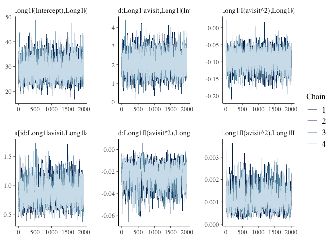
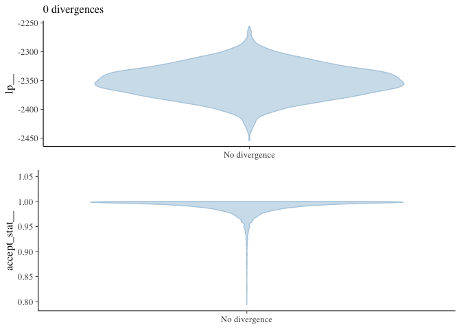
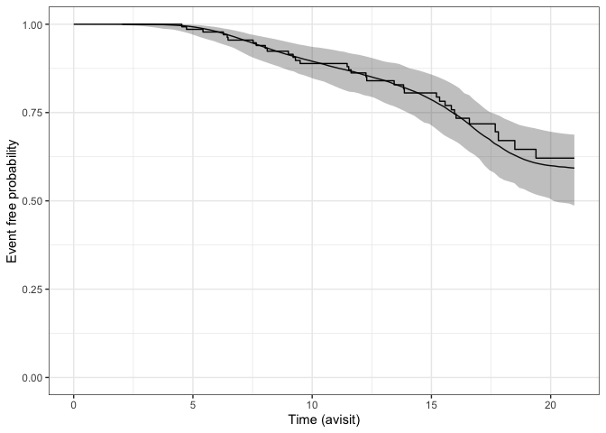
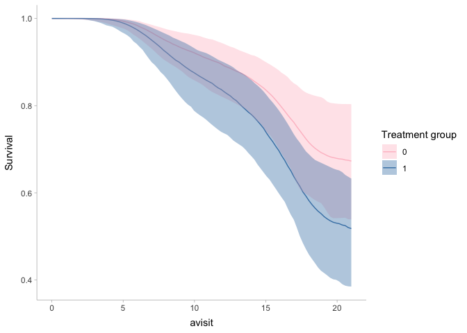

Joint modeling of endpoints for RCT
================
Lars Mølgaard Saxhaug
2022-09-02

Recreation of analysis from [“Joint modeling of endpoints can be used to
answer various research questions in randomized clinical
trials”](https://www.sciencedirect.com/science/article/pii/S0895435622000701#bib33)
(Eijk et al. 2022) using {rstanarm}(Goodrich et al. 2020)

``` r
survival_data <- import(here("data/VPA_SURVIVAL_dataset.xlsx")) |> 
  janitor::clean_names()
str(survival_data)
```

    ## 'data.frame':    154 obs. of  7 variables:
    ##  $ avisit : num  0 0 0 0 0 0 0 0 0 0 ...
    ##  $ total  : num  41 45 46 30 30 43 44 40 43 21 ...
    ##  $ maxtime: num  12 16 16 8 12 20 20 20 20 20 ...
    ##  $ trt    : num  0 0 1 1 0 1 0 1 1 0 ...
    ##  $ stime  : num  13.4 18.5 19.4 12.3 15.3 ...
    ##  $ status : num  1 1 1 1 1 0 0 0 0 0 ...
    ##  $ id     : num  1 2 3 4 5 6 7 8 9 10 ...

``` r
head(survival_data)
```

    ##   avisit total maxtime trt    stime status id
    ## 1      0    41      12   0 13.43737      1  1
    ## 2      0    45      16   0 18.49692      1  2
    ## 3      0    46      16   1 19.38398      1  3
    ## 4      0    30       8   1 12.25462      1  4
    ## 5      0    30      12   0 15.34292      1  5
    ## 6      0    43      20   1 20.63244      0  6

``` r
long_data <- import(here("data/VPA_ALSFRS_dataset.xlsx")) |> 
  janitor::clean_names()
str(long_data)
```

    ## 'data.frame':    701 obs. of  7 variables:
    ##  $ avisit : num  0 2 4 8 12 0 2 4 8 12 ...
    ##  $ total  : num  41 41 39 36 31 45 46 44 42 38 ...
    ##  $ maxtime: num  12 12 12 12 12 16 16 16 16 16 ...
    ##  $ trt    : num  0 0 0 0 0 0 0 0 0 0 ...
    ##  $ stime  : num  13.4 13.4 13.4 13.4 13.4 ...
    ##  $ status : num  1 1 1 1 1 1 1 1 1 1 ...
    ##  $ id     : num  1 1 1 1 1 2 2 2 2 2 ...

``` r
head(long_data)
```

    ##   avisit total maxtime trt    stime status id
    ## 1      0    41      12   0 13.43737      1  1
    ## 2      2    41      12   0 13.43737      1  1
    ## 3      4    39      12   0 13.43737      1  1
    ## 4      8    36      12   0 13.43737      1  1
    ## 5     12    31      12   0 13.43737      1  1
    ## 6      0    45      16   0 18.49692      1  2

``` r
# check if file exists, only run model if it does not
if (file.exists(here("output/fits/model1.Rdata"))) { 
  model1 <- import(here("output/fits/model1.Rdata"))
  
} else {
  model1 <-
    stan_jm(
      formulaLong = total ~ avisit + avisit:trt + (avisit + I(avisit ^ 2) | id), # longitudinal mixed effects model
      dataLong = long_data,
      formulaEvent = Surv(stime, status) ~ trt, # survival model 
      dataEvent = survival_data,
      time_var = "avisit",
      priorEvent = rstanarm::normal(0, 1), # prior on treatment effect in survival model
      iter = 4000,
      adapt_delta = 0.99
    )
  save(model1, file = here("output/fits/model1.Rdata"))
  
}
```

``` r
prior_summary(model1) # 
```

    ## Priors for model 'model1' 
    ## ------
    ## Long1|Intercept (after predictors centered)
    ##   Specified prior:
    ##     ~ normal(location = 0, scale = 10)
    ##   Adjusted prior:
    ##     ~ normal(location = 0, scale = 89)
    ## 
    ## Long1|Coefficients
    ##   Specified prior:
    ##     ~ normal(location = [0,0], scale = [2.5,2.5])
    ##   Adjusted prior:
    ##     ~ normal(location = [0,0], scale = [3.94,4.61])
    ## 
    ## Long1|Auxiliary (sigma)
    ##   Specified prior:
    ##     ~ half-cauchy(location = 0, scale = 5)
    ##   Adjusted prior:
    ##     ~ half-cauchy(location = 0, scale = 44)
    ## 
    ## Event|Coefficients
    ##  ~ normal(location = 0, scale = 1)
    ## 
    ## Event|Auxiliary (B-spline-coefficients)
    ##  ~ cauchy(location = [0,0,0,...], scale = [20,20,20,...])
    ## 
    ## Association parameters
    ##   Specified prior:
    ##     ~ normal(location = 0, scale = 2.5)
    ##   Adjusted prior:
    ##     ~ normal(location = 0, scale = 0.27)
    ## 
    ## Covariance
    ##  ~ lkj(reg. = 1, df = [1,1,1], scale = [10,10,10])
    ##      **adjusted scale = [88.54,15.78, 0.90]
    ## ------
    ## See help('prior_summary.stanreg') for more details

``` r
summary(model1)
```

    ## 
    ## Model Info:
    ## 
    ##  function:         stan_jm
    ##  formula (Long1):  total ~ avisit + avisit:trt + (avisit + I(avisit^2) | id)
    ##  family  (Long1):  gaussian [identity]
    ##  formula (Event):  Surv(stime, status) ~ trt
    ##  baseline hazard:  bs
    ##  assoc:            etavalue (Long1)
    ##  algorithm:        sampling
    ##  sample:           8000 (posterior sample size)
    ##  priors:           see help('prior_summary')
    ##  observations:     701 (Long1)
    ##  subjects:         154
    ##  events:           33 (21.4%)
    ##  groups:           id (154)
    ##  runtime:          44.1 mins
    ## 
    ## Estimates:
    ##                                                 mean      sd        10%    
    ## Long1|(Intercept)                                40.083     0.458    39.499
    ## Long1|avisit                                     -0.969     0.087    -1.082
    ## Long1|avisit:trt                                 -0.116     0.118    -0.268
    ## Long1|sigma                                       2.095     0.088     1.985
    ## Long1|mean_PPD                                   34.659     0.111    34.517
    ## Event|(Intercept)                                -1.608     0.617    -2.394
    ## Event|trt                                         0.525     0.338     0.093
    ## Event|b-splines-coef1                           -14.424     7.796   -25.053
    ## Event|b-splines-coef2                             1.584     2.382    -1.371
    ## Event|b-splines-coef3                            -0.700     1.469    -2.609
    ## Event|b-splines-coef4                            -0.804     1.253    -2.418
    ## Event|b-splines-coef5                             1.758     1.522    -0.167
    ## Event|b-splines-coef6                            -3.733     2.889    -7.575
    ## Assoc|Long1|etavalue                             -0.082     0.018    -0.106
    ## Sigma[id:Long1|(Intercept),Long1|(Intercept)]    28.899     3.741    24.374
    ## Sigma[id:Long1|avisit,Long1|(Intercept)]          2.092     0.520     1.443
    ## Sigma[id:Long1|I(avisit^2),Long1|(Intercept)]    -0.095     0.024    -0.126
    ## Sigma[id:Long1|avisit,Long1|avisit]               0.848     0.177     0.633
    ## Sigma[id:Long1|I(avisit^2),Long1|avisit]         -0.023     0.009    -0.034
    ## Sigma[id:Long1|I(avisit^2),Long1|I(avisit^2)]     0.001     0.000     0.001
    ## log-posterior                                 -2351.737    27.275 -2386.440
    ##                                                 50%       90%    
    ## Long1|(Intercept)                                40.071    40.688
    ## Long1|avisit                                     -0.968    -0.859
    ## Long1|avisit:trt                                 -0.116     0.033
    ## Long1|sigma                                       2.091     2.209
    ## Long1|mean_PPD                                   34.658    34.802
    ## Event|(Intercept)                                -1.610    -0.807
    ## Event|trt                                         0.524     0.955
    ## Event|b-splines-coef1                           -13.187    -5.498
    ## Event|b-splines-coef2                             1.488     4.615
    ## Event|b-splines-coef3                            -0.660     1.146
    ## Event|b-splines-coef4                            -0.780     0.792
    ## Event|b-splines-coef5                             1.738     3.733
    ## Event|b-splines-coef6                            -3.355    -0.352
    ## Assoc|Long1|etavalue                             -0.082    -0.059
    ## Sigma[id:Long1|(Intercept),Long1|(Intercept)]    28.570    33.776
    ## Sigma[id:Long1|avisit,Long1|(Intercept)]          2.067     2.771
    ## Sigma[id:Long1|I(avisit^2),Long1|(Intercept)]    -0.094    -0.065
    ## Sigma[id:Long1|avisit,Long1|avisit]               0.834     1.079
    ## Sigma[id:Long1|I(avisit^2),Long1|avisit]         -0.022    -0.012
    ## Sigma[id:Long1|I(avisit^2),Long1|I(avisit^2)]     0.001     0.002
    ## log-posterior                                 -2351.968 -2316.329
    ## 
    ## Diagnostics:
    ##                                               mcse  Rhat  n_eff
    ## Long1|(Intercept)                             0.014 1.004  1103
    ## Long1|avisit                                  0.002 1.000  2404
    ## Long1|avisit:trt                              0.002 1.000  3304
    ## Long1|sigma                                   0.002 1.001  1557
    ## Long1|mean_PPD                                0.001 1.000  7918
    ## Event|(Intercept)                             0.005 1.000 14339
    ## Event|trt                                     0.002 1.000 21717
    ## Event|b-splines-coef1                         0.109 1.000  5079
    ## Event|b-splines-coef2                         0.036 1.001  4315
    ## Event|b-splines-coef3                         0.023 1.000  4090
    ## Event|b-splines-coef4                         0.019 1.000  4491
    ## Event|b-splines-coef5                         0.022 1.000  4915
    ## Event|b-splines-coef6                         0.038 1.000  5936
    ## Assoc|Long1|etavalue                          0.000 1.000 13782
    ## Sigma[id:Long1|(Intercept),Long1|(Intercept)] 0.079 1.001  2242
    ## Sigma[id:Long1|avisit,Long1|(Intercept)]      0.009 1.001  3014
    ## Sigma[id:Long1|I(avisit^2),Long1|(Intercept)] 0.000 1.001  3902
    ## Sigma[id:Long1|avisit,Long1|avisit]           0.004 1.001  1661
    ## Sigma[id:Long1|I(avisit^2),Long1|avisit]      0.000 1.002  1261
    ## Sigma[id:Long1|I(avisit^2),Long1|I(avisit^2)] 0.000 1.002   974
    ## log-posterior                                 0.948 1.004   828
    ## 
    ## For each parameter, mcse is Monte Carlo standard error, n_eff is a crude measure of effective sample size, and Rhat is the potential scale reduction factor on split chains (at convergence Rhat=1).

#### Diagnostics

``` r
bayesplot::mcmc_trace(model1,regex_pars = "Sigma.*")
```

<!-- -->

``` r
bayesplot::mcmc_nuts_divergence(bayesplot::nuts_params(model1),bayesplot::log_posterior(model1))
```

<!-- -->

#### Posterior predictive check of survival

``` r
ps_check(model1)
```

<!-- -->

#### Plot of survival probabilities conditional on treatment

Averaging across individual-specific predictions within each treatment
group, derived from

<https://discourse.mc-stan.org/t/survival-predictions-by-categorical-covariates-in-stan-jm/9516/4>

``` r
id0 <- survival_data$id[survival_data$trt==0]
id1 <- survival_data$id[survival_data$trt==1]
p0 <- posterior_survfit(model1, ids = id0, standardise = TRUE, times = 0 )
p1 <- posterior_survfit(model1, ids = id1, standardise = TRUE, times = 0 )

p0 |> as_tibble() |> 
  mutate(trt=0) |> 
  bind_rows(p1 |> 
              mutate(trt=1)) |> 
  ggplot(aes(x=avisit,y=median,fill=factor(trt),colour=factor(trt)))+
  geom_line()+
  geom_ribbon(aes(ymin=ci_lb,ymax=ci_ub),alpha=0.4,colour=NA)+
  scale_y_continuous(name = "Survival")+
  scale_colour_manual(values = c("pink","steelblue"))+
  scale_fill_manual(values = c("pink","steelblue"))+
  labs(fill="Treatment group",colour="Treatment group")+
  theme_tidybayes()
```

<!-- -->

#### Bibliography

<div id="refs" class="references csl-bib-body hanging-indent">

<div id="ref-vaneijk2022" class="csl-entry">

Eijk, Ruben P. A. van, Kit C. B. Roes, Leonard H. van den Berg, and Ying
Lu. 2022. “Joint Modeling of Endpoints Can Be Used to Answer Various
Research Questions in Randomized Clinical Trials.” *Journal of Clinical
Epidemiology* 147 (July): 32–39.
<https://doi.org/10.1016/j.jclinepi.2022.03.009>.

</div>

<div id="ref-rstanarm" class="csl-entry">

Goodrich, Ben, Jonah Gabry, Imad Ali, and Sam Brilleman. 2020.
“Rstanarm: Bayesian Applied Regression Modeling via Stan.”
<https://mc-stan.org/rstanarm>.

</div>

</div>
