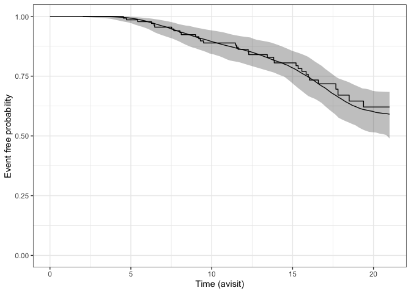

JM for RCT
================
Lars Mølgaard Saxhaug
2022-09-01

``` r
survival_data <- import(here("data/VPA_SURVIVAL_dataset.xlsx")) |> 
  janitor::clean_names()
str(survival_data)
```

    ## 'data.frame':    154 obs. of  7 variables:
    ##  $ avisit : num  0 0 0 0 0 0 0 0 0 0 ...
    ##  $ total  : num  41 45 46 30 30 43 44 40 43 21 ...
    ##  $ maxtime: num  12 16 16 8 12 20 20 20 20 20 ...
    ##  $ trt    : num  0 0 1 1 0 1 0 1 1 0 ...
    ##  $ stime  : num  13.4 18.5 19.4 12.3 15.3 ...
    ##  $ status : num  1 1 1 1 1 0 0 0 0 0 ...
    ##  $ id     : num  1 2 3 4 5 6 7 8 9 10 ...

``` r
head(survival_data)
```

    ##   avisit total maxtime trt    stime status id
    ## 1      0    41      12   0 13.43737      1  1
    ## 2      0    45      16   0 18.49692      1  2
    ## 3      0    46      16   1 19.38398      1  3
    ## 4      0    30       8   1 12.25462      1  4
    ## 5      0    30      12   0 15.34292      1  5
    ## 6      0    43      20   1 20.63244      0  6

``` r
long_data <- import(here("data/VPA_ALSFRS_dataset.xlsx")) |> 
  janitor::clean_names()
str(long_data)
```

    ## 'data.frame':    701 obs. of  7 variables:
    ##  $ avisit : num  0 2 4 8 12 0 2 4 8 12 ...
    ##  $ total  : num  41 41 39 36 31 45 46 44 42 38 ...
    ##  $ maxtime: num  12 12 12 12 12 16 16 16 16 16 ...
    ##  $ trt    : num  0 0 0 0 0 0 0 0 0 0 ...
    ##  $ stime  : num  13.4 13.4 13.4 13.4 13.4 ...
    ##  $ status : num  1 1 1 1 1 1 1 1 1 1 ...
    ##  $ id     : num  1 1 1 1 1 2 2 2 2 2 ...

``` r
head(long_data)
```

    ##   avisit total maxtime trt    stime status id
    ## 1      0    41      12   0 13.43737      1  1
    ## 2      2    41      12   0 13.43737      1  1
    ## 3      4    39      12   0 13.43737      1  1
    ## 4      8    36      12   0 13.43737      1  1
    ## 5     12    31      12   0 13.43737      1  1
    ## 6      0    45      16   0 18.49692      1  2

``` r
if (file.exists(here("output/fits/model1.Rdata"))) {
  model1 <- import(here("output/fits/model1.Rdata"))
  
} else {
  model1 <-
    stan_jm(
      formulaLong = total ~ avisit + avisit:trt + (avisit + I(avisit ^ 2) |
                                                     id),
      dataLong = long_data,
      formulaEvent = Surv(stime, status) ~ trt,
      dataEvent = survival_data,
      time_var = "avisit",
      priorEvent = rstanarm::normal(0, 1),
      iter = 4000
    )
  save(model1, file = here("output/fits/model1.Rdata"))
  
}
```

``` r
ps_check(model1)
```

<!-- -->
